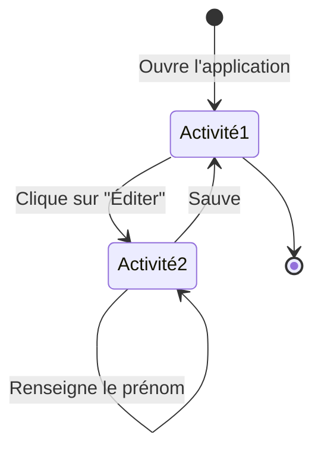
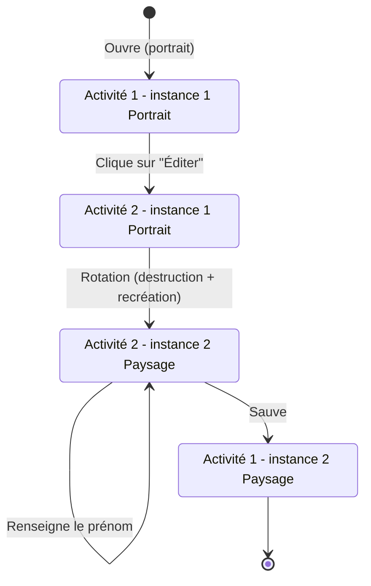

# Rapport - Les Activités et les Fragments

Auteur : Alberto de Sousa Lopes, Maikol da Correia Silva

## Manipulation 1 - Les Activités

> Que se passe-t-il si l’utilisateur appuie sur « back » lorsqu’il se trouve sur la seconde Activité ?

La seconde Activité est dépilée et l'utilisateur retourne sur la première Activité.

> Veuillez réaliser un diagramme des changements d’état des deux Activités pour les utilisations suivantes, vous mettrez en évidence les différentes instances de chaque Activité :

- L’utilisateur ouvre l’application, clique sur le bouton éditer, renseigne son prénom et sauve.

- L’utilisateur ouvre l’application en mode portrait, clique sur le bouton éditer, bascule en mode paysage, renseigne son prénom et sauve.

> Que faut-il mettre en place pour que vos Activités supportent la rotation de l’écran ? Est-ce nécessaire de le réaliser pour les deux Activités, quelle est la différence ?
 
_Hint : Que se passe-t-il si on bascule la première Activité après avoir saisi son prénom ? Comment peut-on éviter ce comportement indésirable ? Quelle est la différence avec la seconde Activité ?_

Il faut mettre en place la sauvegarde de l’état pour la première Activité. En effet, si l’utilisateur bascule la première Activité après avoir saisi son prénom, l’Activité est détruite puis recréée lors du changement de configuration (passage du mode portrait au mode paysage). Sans sauvegarde de l’état, le prénom saisi risque alors d’être perdu.

Pour la deuxième Activité, la sauvegarde du prénom n’est pas nécessaire dans le scénario donné, car l’utilisateur effectue la rotation avant de saisir son prénom. Même si la deuxième Activité est elle aussi détruite puis recréée lors de la rotation, aucune donnée saisie par l’utilisateur n’est encore à conserver.

## Manipulation 2 - Les Fragments

> Les deux Fragments fournis implémentent la restauration de leur état. Si on enlève la sauvegarde de l’état sur le ColorFragment sa couleur sera tout de même restaurée, comment pouvons-nous expliquer cela ?

Même sans sauvegarder explicitement la variable `color` dans le `ColorFragment`, la couleur peut être restaurée après une rotation. En effet, les trois composantes de la couleur sont représentées par des `SeekBar`, et Android sauvegarde automatiquement l'état de certaines `View`, notamment leur valeur `progress`.

Lors de la recréation du `Fragment`, Android restaure donc automatiquement l'état des `SeekBar`. Comme les valeurs R, G et B permettent de déterminer la couleur, celle-ci peut être retrouvée sans avoir besoin de sauvegarder explicitement la variable `color`.

La sauvegarde avec `onSaveInstanceState()` reste néanmoins utile lorsque l'état important de l'application est stocké dans des variables qui ne sont pas directement gérées par les `View`.

> Si nous plaçons deux fois le CounterFragment dans l’Activité, nous aurons deux instances indépendantes de celui-ci. Comment est-ce que la restauration de l’état se passe en cas de rotation de l’écran ?

Si deux instances du `CounterFragment` sont placées dans la même Activité, elles possèdent chacune leur propre état et leur propre valeur du compteur. Lors d'une rotation de l'écran, Android sauvegarde séparément l'état de chaque instance du Fragment.

Lors de la recréation de l'Activité, Android recrée les deux instances et restaure pour chacune le `savedInstanceState` qui lui correspond. Les deux compteurs retrouvent donc leurs valeurs respectives et restent indépendants.

Par exemple, si le premier compteur vaut 5 et le deuxième 12 avant la rotation, ils vaudront toujours respectivement 5 et 12 après la rotation.
