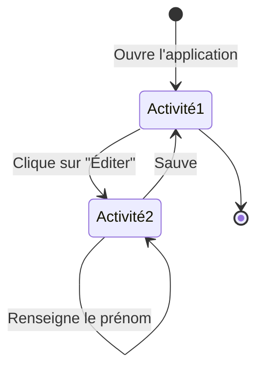
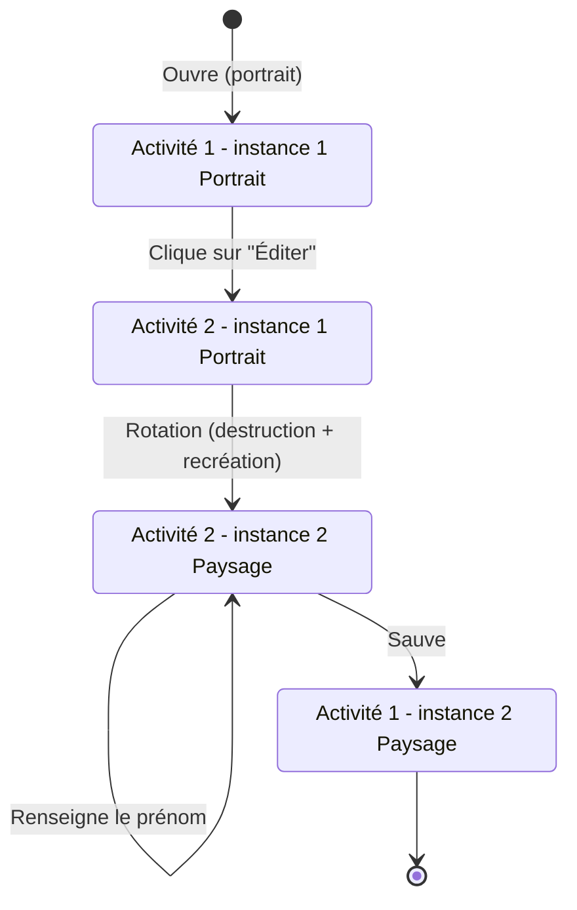

# Rapport - Les Activités et les Fragments

Auteur : Alberto de Sousa Lopes, Maikol da Correia Silva

## Manipulation 1 - Les Activités

> Que se passe-t-il si l’utilisateur appuie sur « back » lorsqu’il se trouve sur la seconde Activité ?

La seconde Activité est dépilée et l'utilisateur retourne sur la première Activité.

> Veuillez réaliser un diagramme des changements d’état des deux Activités pour les utilisations suivantes, vous mettrez en évidence les différentes instances de chaque Activité :

- L’utilisateur ouvre l’application, clique sur le bouton éditer, renseigne son prénom et sauve.

- L’utilisateur ouvre l’application en mode portrait, clique sur le bouton éditer, bascule en mode paysage, renseigne son prénom et sauve.

> Que faut-il mettre en place pour que vos Activités supportent la rotation de l’écran ? Est-ce nécessaire de le réaliser pour les deux Activités, quelle est la différence ?
 
_Hint : Que se passe-t-il si on bascule la première Activité après avoir saisi son prénom ? Comment peut-on éviter ce comportement indésirable ? Quelle est la différence avec la seconde Activité ?_

Il faut mettre en place la sauvegarde de l’état pour la première Activité. En effet, si l’utilisateur bascule la première Activité après avoir saisi son prénom, l’Activité est détruite puis recréée lors du changement de configuration (passage du mode portrait au mode paysage). Sans sauvegarde de l’état, le prénom saisi risque alors d’être perdu.

Pour la deuxième Activité, la sauvegarde du prénom n’est pas nécessaire dans le scénario donné, car l’utilisateur effectue la rotation avant de saisir son prénom. Même si la deuxième Activité est elle aussi détruite puis recréée lors de la rotation, aucune donnée saisie par l’utilisateur n’est encore à conserver.
